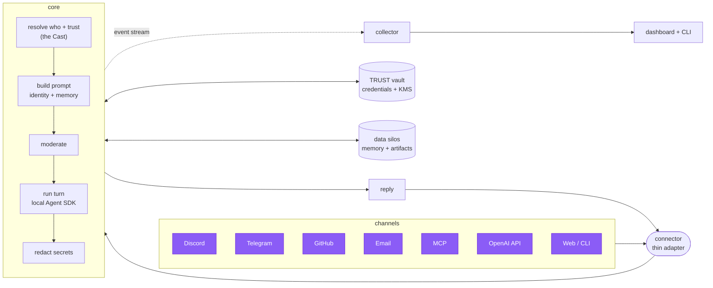

<p align="center"></p>

<h1 align="center">asmltr</h1>

<p align="center"><b>Run one AI assistant that's the same self on every channel — and owns its identity, memory, credentials, and login.</b></p>

<p align="center"><i>Say it “assimilator.” It stands for <b>A</b>gentic <b>S</b>peech, <b>M</b>essaging, <b>L</b>ikeness, <b>T</b>rust, and <b>R</b>outing — one agent that assimilates every channel while staying recognizably itself.</i></p>

<p align="center">
  <a href="https://jarethmt.github.io/asmltr/"></a>
  
  
</p>

### 📚 Full documentation → **[jarethmt.github.io/asmltr](https://jarethmt.github.io/asmltr/)**

---

## What is asmltr?

asmltr is a **self-hosted platform for a single AI assistant** — one that runs on *your* hardware, thinks
on *your* Claude subscription (via the local Agent SDK, not a metered API key), and shows up as the **same
self** wherever people reach it: Discord, Telegram, email, GitHub, an MCP client, any OpenAI-compatible
app, the web dashboard, or your terminal.

It started as a channel-agnostic router. It's grown into the whole assistant: a **persistent identity and
memory**, a **use-but-never-see credential vault**, a **built-in login you can put in front of your other
services**, encrypted **backups**, and a **live dashboard** over everything it does — all wrapped around
that one brain.

## Why you'd want it

- **One assistant, reachable everywhere — same brain, same memory.** Not seven disconnected bots; one
  agent with shared sessions, identity, and history across every surface.
- **It's yours.** Your machine, your Claude subscription (no per-token billing, full filesystem + project
  context + skills), your data. Nothing phones home.
- **It has a self.** A persistent identity anchor, an aesthetic, a model of the people it talks to (the
  *Cast*), and **[data silos](https://jarethmt.github.io/asmltr/silos/)** — its memory and the default
  home for everything it creates — that travel with it across channels.
- **Credentials it can use but never sees.** Secrets live in a [TRUST-Protocol vault](https://jarethmt.github.io/asmltr/security/trust-vault/)
  (broker + KMS); the agent gets *use* of an API without the raw key ever entering its context. Data at
  rest is AES-256-GCM encrypted with vault-held keys.
- **It's also your login.** Built-in auth gates the dashboard (password + TOTP + **passkeys**) and can gate
  *your other services* too — forward-auth (Authelia-style) **and** a full **OIDC provider**. asmltr can be
  the identity plane for your whole stack.
- **Portable and restorable.** Encrypted, vault-independent **[backups](https://jarethmt.github.io/asmltr/backups/)**
  (local or off-box, scheduled with retention) and a deterministic, rollback-safe self-updater.
- **One pane of glass.** A Vue dashboard + a terminal TUI over every session, token, and event — with live
  **takeover**: stop or steer any running session from the browser or the terminal.

## The five pillars

The name maps to what it does:

| | Pillar | What it means |
|---|---|---|
| **S** | **Speech** | Voice as a first-class capability, not an afterthought — shared STT/TTS in the core, realtime hands-free dictation, Discord voice mode, read-aloud + a PWA. |
| **M** | **Messaging** | Every channel — Discord, Telegram, email, GitHub, MCP, OpenAI-compatible API, web, CLI — through one brain, with cross-channel identity and monitoring. |
| **L** | **Likeness** | A persistent self: identity anchor + aesthetic injected into every turn, the *Cast* (who it's talking to, across channels), and data silos for memory + artifacts. |
| **T** | **Trust** | Default-deny trust + LLM moderation + output redaction, the credential **vault** (use-but-never-see + KMS), and built-in **auth / identity provider**. |
| **R** | **Routing** | The channel-agnostic core: normalize → resolve → moderate → run (local Agent SDK) → redact → reply. Add a channel by writing one thin adapter. |

---

## ⚡ Quick setup — paste this to your AI agent

On a box with **Claude Code** (or any capable coding agent) installed and authenticated, paste this one line:

```
Download https://raw.githubusercontent.com/jarethmt/asmltr/main/INSTALL-WITH-AGENT.md with wget, then follow its instructions to install and configure asmltr on this machine, asking me for any values (tokens, IDs, the assistant's name) you need.
```

The agent clones the repo, installs dependencies, configures `.env`, seeds the trust store, starts the
services, and wires up whichever channels you want. Prefer to do it by hand? See the [manual Quickstart](#quickstart) below.

**Already installed?** To pull the latest version and restart, paste this instead:

```
Download https://raw.githubusercontent.com/jarethmt/asmltr/main/UPDATE-WITH-AGENT.md with wget, then follow its instructions to update this asmltr install to the latest version and restart it.
```

---

## How it works



A **connector** is thin I/O: it knows *how* its channel works (tokens, polling, message shapes) and
nothing else. Everything shared — identity, memory, trust, moderation, prompt-building, execution,
redaction, credentials — lives in the **core**. Add a channel by writing one adapter that emits an
envelope and renders a reply. → [How it works](https://jarethmt.github.io/asmltr/how-it-works/) ·
[Architecture](https://jarethmt.github.io/asmltr/architecture/)

---

## What's inside

| Area | Highlights | Docs |
|------|-----------|------|
| **Channels** | Discord (+ autonomous participation, multi-agent, voice), Telegram, Email (SMTP/IMAP), GitHub issues, MCP (OAuth 2.1), OpenAI-compatible API, web chat, CLI. | [Connectors](https://jarethmt.github.io/asmltr/connectors/discord/) |
| **Identity & memory** | Self anchor + aesthetic injected every turn; the *Cast* (cross-channel relationships); **data silos** — the assistant's memory and the default home for its artifacts, with layered search. | [Silos](https://jarethmt.github.io/asmltr/silos/) |
| **Credentials** | A [TRUST-Protocol vault](https://jarethmt.github.io/asmltr/security/trust-vault/): use-but-never-see credential broker + KMS envelope encryption; storage integrations (WebDAV / S3 / local) with encryption-at-rest. | [Vault](https://jarethmt.github.io/asmltr/security/trust-vault/) · [Integrations](https://jarethmt.github.io/asmltr/integrations/) |
| **Auth / identity provider** | Login the dashboard with password + TOTP + **passkeys**; gate *other* services via forward-auth **and** a standards **OIDC provider**. | [Auth](https://jarethmt.github.io/asmltr/AUTH/) |
| **Backups** | Encrypted, vault-independent snapshots (SQLite + config + identity + silos); local or off-box; scheduled with retention; verified restore. | [Backups](https://jarethmt.github.io/asmltr/backups/) |
| **Observability** | Vue dashboard + terminal TUI: live sessions, cross-surface timeline, token usage, host metrics — and live **takeover** (stop / steer any session). | [Dashboard](https://jarethmt.github.io/asmltr/dashboard/) · [CLI](https://jarethmt.github.io/asmltr/cli/) |
| **Operations** | Deterministic, rollback-safe self-updater with `stable` / `edge` channels; semver releases; a shared settings manifest that drives the GUI *and* the TUI. | [Updater](https://jarethmt.github.io/asmltr/UPDATER-DESIGN/) |

*Roadmap:* OIDC **client** (log into asmltr via an external IdP), login→vault unlock, a
[federation](https://jarethmt.github.io/asmltr/FEDERATION/) mesh of cooperating agents, and sleep/dream
memory consolidation.

---

## Components

| Dir | What | Runs as |
|---|---|---|
| `core/` | **asmltr-core** — the pipeline: envelope, identity/Cast, sessions, moderation, execution, redaction, vault, silos, auth + OIDC provider. | Host (PM2), `127.0.0.1` |
| `connectors/` | The connector **manager** (supervisor + config API) and **types** (`discord`, `telegram`, `email`, `github`, `mcp`, `openai`). Each enabled instance is its own child process. | Host (PM2), `127.0.0.1` |
| `insights/collector/` | Telemetry collector — ingests the shared event stream, samples metrics, serves REST + socket.io. | Host (PM2), `127.0.0.1` |
| `insights/dashboard/` | Vue 3 dashboard: sessions, timeline, usage, silos explorer, vault + integrations, security (login/2FA/passkeys/OIDC clients), settings. | Static build (behind asmltr's own auth) |
| `cli/` | **`asmltr`** — terminal client + TUI, plus `silo`, `backup`, and `vault` subcommands. | Host CLI |
| `shared/` | Cross-cutting: events, secrets provider, `.env` loader, redaction, **vault** client, **storage** drivers, **silo** construct, **auth** (sessions/2FA), speech (STT/TTS). | — |
| `scripts/` | Deterministic updater, release cutter, and **backup** (create / verify / restore). | — |

---

## Non-negotiables (read before changing anything)

- **Execution is LOCAL via the Agent SDK** (`@anthropic-ai/claude-agent-sdk`), on *your Claude
  subscription* — the same auth Claude Code uses. **Never introduce an `ANTHROPIC_API_KEY` execution
  path**: it switches to metered billing and loses local filesystem / project-context / skills access.
- **core and collector run on the host (PM2), not in Docker.** They spawn the local `claude` binary
  (which needs `~/.claude` auth + host FS + your project context) and signal host pids. Containerizing
  them breaks both. Connectors can run in Docker and reach the host via `host.docker.internal`.
- **Bind `127.0.0.1` only.** Put a reverse proxy in front of anything you expose — asmltr's own built-in
  auth can be that gate.

---

## Requirements

- **Node.js ≥ 24** (current Active LTS; pinned in `.nvmrc`).
- **Claude Code CLI, installed and authenticated** (`claude` on PATH — the SDK uses its auth). This is the assistant's brain.
- **PM2** (`npm i -g pm2`) to run the host services.
- **ffmpeg** — only for the Discord voice mode.
- Optional: a **[TRUST Protocol](https://github.com/jarethmt/trust-protocol)** instance for the vault; API keys as needed (**OpenAI** for moderation/voice, each channel's bot token / PAT).

---

## Quickstart

```bash
git clone <your-fork-url> asmltr && cd asmltr

# 1. Install dependencies (each component is its own package)
for d in core connectors insights/collector cli; do (cd "$d" && npm install); done

# 2. Configure
cp .env.example .env                 # then edit: ASSISTANT_NAME, secrets, ports

# 3. Seed the trust store (DEFAULT-DENY — nobody has access until seeded)
cp core/src/trust/seed.example.json core/src/trust/seed.json   # add yourself as owner
node core/src/trust/seed.js

# 4. Start the host services
pm2 start core/ecosystem.config.js
pm2 start insights/collector/ecosystem.config.js
pm2 start connectors/manager/ecosystem.config.js

# 5. Add a channel instance (example: Discord) via the manager API or the dashboard
curl -s -X POST 127.0.0.1:3024/instances -H 'Content-Type: application/json' -d '{
  "type":"discord","name":"my-bot","enabled":true,
  "config":{"bot_token_bws_key":"discord_bot_token","dm_allowed_user_id":"<your-discord-id>"}
}'
```

**Optional next steps:** turn on the [vault](https://jarethmt.github.io/asmltr/security/trust-vault/)
(`asmltr vault init`), enable [built-in auth](https://jarethmt.github.io/asmltr/AUTH/) (`ASMLTR_AUTH=on`),
and schedule [backups](https://jarethmt.github.io/asmltr/backups/). Prefer to let an AI agent do the whole
install? See **[INSTALL-WITH-AGENT.md](INSTALL-WITH-AGENT.md)**.

---

## Security model

- **Trust is default-deny.** Only seeded principals (or ones added via the Access UI) get access; each
  carries capability grants. → [Trust & permissions](https://jarethmt.github.io/asmltr/security/trust/)
- **Moderation** — every inbound message gets an LLM security screen before execution (stricter for
  low-trust principals). → [Moderation](https://jarethmt.github.io/asmltr/security/moderation/)
- **Output redaction** — `shared/redact.js` masks tokens/keys/passwords from replies on public surfaces
  and for any non-full-trust recipient.
- **Credentials never in the repo, never in the model.** Secrets resolve at runtime through a pluggable
  provider (env → file → **vault** → command); the vault brokers *use* of a secret without exposing the
  raw value to the agent's context. → [Secrets](https://jarethmt.github.io/asmltr/security/secrets/)
- **Built-in auth** — session gate with password + TOTP + passkeys; a forward-auth endpoint and OIDC
  provider to gate the rest of your stack; instant break-glass (`ASMLTR_AUTH=off` + restart).

---

## License

See [LICENSE](LICENSE).
