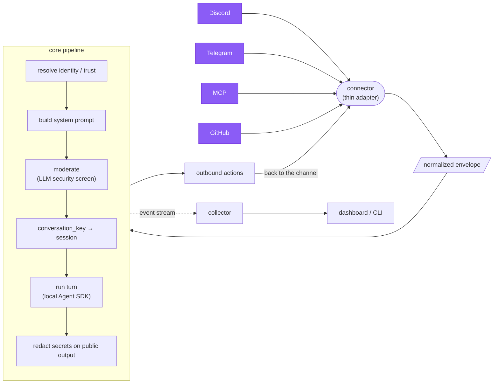

# asmltr

**One channel-agnostic backend behind every chat surface for a single AI assistant — with a live insights dashboard.**

Run *one* assistant (backed by your Claude subscription via the local Agent SDK) and let people
reach it from **Discord, Telegram, an MCP client, and GitHub issues** — all through the same brain,
with shared memory, a unified trust/permission model, moderation, and per-secret output redaction.
A collector + dashboard give you one pane of glass over everything the assistant is doing.

> asmltr is deliberately scoped to **asynchronous chat channels + monitoring**. It is not a
> voice-assistant framework (though the Discord connector does have an optional voice mode).

## ⚡ Quick setup — paste this to your AI agent

On a box with **Claude Code** (or any capable coding agent) installed and authenticated, paste this one line:

```
Download https://raw.githubusercontent.com/jarethmt/asmltr/main/INSTALL-WITH-AGENT.md with wget, then follow its instructions to install and configure asmltr on this machine, asking me for any values (tokens, IDs, the assistant's name) you need.
```

The agent clones the repo, installs dependencies, configures `.env`, seeds the trust store, starts the
services, and wires up whichever channels you want. Prefer to do it by hand? See the [manual Quickstart](#quickstart) below.

**Already installed?** To pull the latest version and restart, paste this instead:

```
Download https://raw.githubusercontent.com/jarethmt/asmltr/main/UPDATE-WITH-AGENT.md with wget, then follow its instructions to update this asmltr install to the latest version and restart it.
```

---

## How it works



A **connector** is thin I/O: it knows *how* its channel works (tokens, polling, message shapes) and
nothing else. Everything shared — sessions, identity, trust, moderation, prompt-building, execution,
redaction — lives in the **core**. Add a channel by writing one adapter that emits an envelope and
renders a reply.

---

## Components

| Dir | What | Runs as |
|---|---|---|
| `core/` | **asmltr-core** — the channel-agnostic backend: envelope pipeline, sessions, trust, moderation, execution, redaction. | Host process (PM2), `127.0.0.1` |
| `connectors/` | The connector **manager** (supervisor + config API) and the four connector **types** (`discord`, `telegram`, `mcp`, `github`). Each enabled instance runs as its own child process. | Host process (PM2), `127.0.0.1` |
| `insights/collector/` | Telemetry collector — ingests the shared event stream, samples metrics, serves REST + socket.io. | Host process (PM2), `127.0.0.1` |
| `insights/dashboard/` | Vue 3 dashboard: live sessions, cross-surface timeline, usage, the trust **Access** page. | Static build (front with your own proxy/auth) |
| `cli/` | **`asmltr`** — terminal client + TUI over the collector API. | Host CLI |
| `shared/` | Cross-cutting modules: the event-stream contract (`events.js`), the secret provider (`secrets.js`), the `.env` loader (`loadenv.js`), and the redaction layer (`redact.js`). | — |

---

## Non-negotiables (read before changing anything)

- **Execution is LOCAL via the Agent SDK** (`@anthropic-ai/claude-code`), on *your Claude
  subscription* — the same auth Claude Code uses. **Do not introduce an `ANTHROPIC_API_KEY`
  execution path**: it switches to metered billing and loses local filesystem / project-context / skills access.
- **core and collector run on the host (PM2), not in Docker.** They spawn the local `claude`
  binary (which needs `~/.claude` auth + host FS + your project context) and signal host pids.
  Containerizing them breaks both. Connectors can run in Docker and reach the host via `host.docker.internal`.
- **Bind `127.0.0.1` only.** Put a reverse proxy (with auth) in front of anything you expose.

---

## Requirements

- **Node.js ≥ 18** (for global `fetch`/`FormData`/`Blob`).
- **Claude Code CLI, installed and authenticated** (`claude` on PATH; the SDK uses its auth). This is the assistant's brain.
- **PM2** (`npm i -g pm2`) to run the host services.
- **ffmpeg** — only if you use the Discord voice mode (audio decode + playback).
- API keys as needed: **OpenAI** (moderation; Discord voice STT), **ElevenLabs** (Discord voice TTS, optional), plus each channel's bot token / PAT.

---

## Quickstart

```bash
git clone <your-fork-url> asmltr && cd asmltr

# 1. Install dependencies (each component is its own package)
for d in core connectors insights/collector cli; do (cd "$d" && npm install); done

# 2. Configure
cp .env.example .env                 # then edit: ASSISTANT_NAME, secrets, ports
#   secrets: set OPENAI_API_KEY etc. directly, or point ASMLTR_SECRET_CMD at your vault

# 3. Seed the trust store (DEFAULT-DENY — nobody has access until seeded)
cp core/src/trust/seed.example.json core/src/trust/seed.json   # edit: add yourself as owner
node core/src/trust/seed.js

# 4. Start the host services
pm2 start core/ecosystem.config.js
pm2 start insights/collector/ecosystem.config.js
pm2 start connectors/manager/ecosystem.config.js

# 5. Add a channel instance (example: Discord) via the manager API or the dashboard
curl -s -X POST 127.0.0.1:3024/instances -H 'Content-Type: application/json' -d '{
  "type":"discord","name":"my-bot","enabled":true,
  "config":{"bot_token_bws_key":"discord_bot_token","dm_allowed_user_id":"<your-discord-id>"}
}'
```

**Prefer to let an AI agent do all of this?** See **[INSTALL-WITH-AGENT.md](INSTALL-WITH-AGENT.md)** —
`wget` it onto a box with Claude Code and the agent will install, configure, and prompt you for the values it needs.

---

## Connectors

Each connector's full config schema is discoverable at `GET /types` on the manager, or in its
`meta.configSchema` (`connectors/types/<type>/index.js`). Highlights:

- **discord** — mention/DM + autonomous participation, an `@mention` command system, multi-agent group
  chats, and an optional **voice mode** (join a voice channel → live transcription → spoken replies).
  **Full guide: [docs/DISCORD.md](docs/DISCORD.md).**
- **telegram** — 1:1 bot with photo→vision. Key config: `bot_token_bws_key`, `allowed_chat_ids`.
- **mcp** — OAuth 2.1 MCP server exposing an `ask_<assistant>` tool (SSE + Streamable HTTP). Pre-register
  clients in `connectors/types/mcp/clients.json` (see `clients.example.json`); each client maps to a trust principal.
- **github** — mention-driven, repo-aware issue assistant: clones the repo, answers in a live-updating
  comment, authenticates as its own PAT account. Key config: `mention`, `pat_bws_key`, `repos`, `dry_run`.

---

## Security model

- **Trust is default-deny.** Only principals seeded into the trust store (or added via the Access UI)
  get access; each carries capability grants. `bypass_moderation` = full trust. See `core/src/trust/`.
- **Moderation** — every inbound message gets an LLM security screen before execution (strict mode for
  low-trust principals). Provider/model/key and alert routing are all configurable — see [docs/MODERATION.md](docs/MODERATION.md).
- **Output redaction** — `shared/redact.js` masks tokens/keys/passwords/private-keys from replies on
  **public** surfaces (and for any non-full-trust recipient). Private DMs with a full-trust owner see raw output.
- **Secrets never live in the repo.** They resolve at runtime through the pluggable provider
  (`shared/secrets.js`): env → secrets file → command. Config files that hold secrets
  (`.env`, `clients.json`, `seed.json`, `channel-aliases.json`) are gitignored; commit only their `.example` twins.

---

## License

See [LICENSE](LICENSE).
