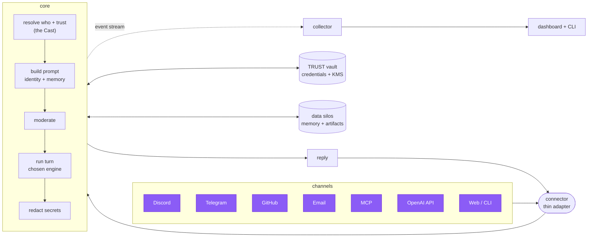

<p align="center"></p>

<h1 align="center">asmltr</h1>

<p align="center"><b>One AI assistant that's the same self everywhere you talk to it — and that you fully own.</b></p>

<p align="center"><i>Say it “assimilator.” It stands for <b>A</b>gentic <b>S</b>peech, <b>M</b>essaging, <b>L</b>ikeness, <b>T</b>rust, and <b>R</b>outing — one assistant that assimilates every channel while staying recognizably itself.</i></p>

<p align="center">
  <a href="https://jarethmt.github.io/asmltr/"></a>
  
  
</p>

### 📚 Full documentation → **[jarethmt.github.io/asmltr](https://jarethmt.github.io/asmltr/)**

---

## What is this, really?

Most "AI assistants" are a single chat window. You type, it answers, and when you close the tab it
forgets you. If you use it in three different apps, you've got three strangers who've never met.

**asmltr is one assistant that shows up in all of those places as the same self.** Message it on
Discord, email it, @-mention it on GitHub, talk to it in your terminal, or open its web dashboard —
it's always the *same* assistant, with the same memory, the same personality, and the same
understanding of who you are. Not seven disconnected bots. One.

And it's **yours**. It runs on your own machine, thinks on your own AI subscription, and keeps your
data on hardware you control. Nothing phones home.

## What you actually get

<table>
<tr><td width="50%" valign="top">

🧠 **One brain, everywhere.**
The same assistant across Discord, Telegram, email, GitHub, the web, and your terminal — sharing one
memory and one identity, not starting from scratch each time.

🎭 **It has a self.**
A persistent personality and taste, its own memory it carries between channels, and a real sense of
the people it talks to — holding each of you as a distinct someone.

🔒 **It earns trust; it doesn't assume it.**
A stranger gets nothing by default. Access grows as trust is earned and drops the instant something's
off — and a human always has the final say on the big stuff.

</td><td width="50%" valign="top">

🔑 **Credentials it can use but never sees.**
Your passwords and API keys live in a locked vault. The assistant gets to *use* them without the raw
secret ever passing through its "mind."

🪪 **It can be your login, too.**
The same door that protects its dashboard (password + two-factor + passkeys) can protect your *other*
apps — so asmltr becomes the single sign-in for your whole setup.

💾 **Portable and recoverable.**
Encrypted backups you can take on a schedule and restore anywhere — so moving to a new machine, or
recovering from a bad day, is a non-event.

</td></tr>
</table>

> **Want the story behind the design — self, others, and trust, in plain language?**
> Read **[How it works](https://jarethmt.github.io/asmltr/how-it-works/)**. No code, no jargon, just the ideas.

---

## 🛠️ Are you a developer and want to know more?

asmltr is a channel-agnostic assistant platform you can extend, self-host, and reshape. If you want
to understand how it's built — or run and hack on it yourself — start here:

<table>
<tr>
<td width="33%" valign="top">

**Understand it**
- [How it works](https://jarethmt.github.io/asmltr/how-it-works/) — the ideas, plainly
- [Architecture](https://jarethmt.github.io/asmltr/architecture/) — the pipeline, end to end
- [Reasoning engines](https://jarethmt.github.io/asmltr/engines/) — swap Claude / Gemini / Codex / self-hosted

</td>
<td width="33%" valign="top">

**Run it**
- [Install](https://jarethmt.github.io/asmltr/getting-started/install/) & [Quick start](https://jarethmt.github.io/asmltr/getting-started/quickstart/)
- [The dashboard](https://jarethmt.github.io/asmltr/dashboard/) & [CLI](https://jarethmt.github.io/asmltr/cli/)
- [Backups](https://jarethmt.github.io/asmltr/backups/) · [Updates](https://jarethmt.github.io/asmltr/UPDATER-DESIGN/)

</td>
<td width="33%" valign="top">

**Extend it**
- [Connectors](https://jarethmt.github.io/asmltr/connectors/) — add a channel
- [MCP tools registry](https://jarethmt.github.io/asmltr/engines-mcp/) — give every engine your tools
- [Security & trust](https://jarethmt.github.io/asmltr/security/trust/) · [Vault](https://jarethmt.github.io/asmltr/security/trust-vault/)

</td>
</tr>
</table>

The rest of this page is the developer quick reference. Everything below assumes you're comfortable
in a terminal.

---

## The five pillars

The name maps to what it does:

| | Pillar | What it means |
|---|---|---|
| **S** | **Speech** | Voice as a first-class capability — shared STT/TTS in the core, realtime hands-free dictation, Discord voice mode, read-aloud + a PWA. |
| **M** | **Messaging** | Every channel — Discord, Telegram, email, GitHub, MCP, OpenAI-compatible API, web, CLI — through one brain, with cross-channel identity and monitoring. |
| **L** | **Likeness** | A persistent self: identity anchor + aesthetic injected into every turn, the *Cast* (who it's talking to, across channels), and data silos for memory + artifacts. |
| **T** | **Trust** | Default-deny trust + LLM moderation + output redaction, the credential **vault** (use-but-never-see + KMS), and built-in **auth / identity provider**. |
| **R** | **Routing** | The channel-agnostic core: normalize → resolve → moderate → run → redact → reply. Add a channel by writing one thin adapter. |

## Reasoning engines — pick your brain

asmltr's thinking is a **swappable layer**. Run it on **Claude Code** (on your subscription, the
default), **Gemini CLI**, **Codex CLI**, or your own **self-hosted model** behind an OpenAI-compatible
endpoint. Pick one as the default and *every* channel uses it — subscription login or a vaulted API
key, your choice. The core loads only the engine you use, so a Gemini-only or Codex-only box never
touches the Claude SDK. → [Reasoning engines](https://jarethmt.github.io/asmltr/engines/)

## How it works



A **connector** is thin I/O: it knows *how* its channel works (tokens, polling, message shapes) and
nothing else. Everything shared — identity, memory, trust, moderation, prompt-building, execution,
redaction, credentials — lives in the **core**. Add a channel by writing one adapter that emits an
envelope and renders a reply. → [How it works](https://jarethmt.github.io/asmltr/how-it-works/) ·
[Architecture](https://jarethmt.github.io/asmltr/architecture/)

## What's inside

| Area | Highlights | Docs |
|------|-----------|------|
| **Reasoning engines** | Pluggable agentic backends — **Claude Code, Gemini CLI, Codex CLI, or a self-hosted model**. One default drives every channel (subscription or vaulted API key); per-engine model, one-click install/update + auto-update; an [MCP registry](https://jarethmt.github.io/asmltr/engines-mcp/) provisioned into every harness. | [Engines](https://jarethmt.github.io/asmltr/engines/) |
| **Channels** | Discord (+ autonomous participation, multi-agent, voice), Telegram, Email (SMTP/IMAP), GitHub issues, MCP (OAuth 2.1), OpenAI-compatible API, web chat, CLI. | [Connectors](https://jarethmt.github.io/asmltr/connectors/discord/) |
| **Identity & memory** | Self anchor + aesthetic injected every turn; the *Cast* (cross-channel relationships); **data silos** — the assistant's memory and the default home for its artifacts, with layered search. | [Silos](https://jarethmt.github.io/asmltr/silos/) |
| **Credentials** | A [TRUST-Protocol vault](https://jarethmt.github.io/asmltr/security/trust-vault/): use-but-never-see credential broker + KMS envelope encryption; storage integrations (WebDAV / S3 / local) with encryption-at-rest. | [Vault](https://jarethmt.github.io/asmltr/security/trust-vault/) · [Integrations](https://jarethmt.github.io/asmltr/integrations/) |
| **Auth / identity provider** | Login the dashboard with password + TOTP + **passkeys**; gate *other* services via forward-auth **and** a standards **OIDC provider**. | [Auth](https://jarethmt.github.io/asmltr/AUTH/) |
| **Backups** | Encrypted, vault-independent snapshots (SQLite + config + identity + silos); local or off-box; scheduled with retention; **guarded restore + import from the dashboard**. | [Backups](https://jarethmt.github.io/asmltr/backups/) |
| **Observability** | Vue dashboard + terminal TUI: live sessions, cross-surface timeline, token usage, host metrics — and live **takeover** (stop / steer any session). | [Dashboard](https://jarethmt.github.io/asmltr/dashboard/) · [CLI](https://jarethmt.github.io/asmltr/cli/) |
| **Operations** | Deterministic, rollback-safe self-updater with `stable` / `edge` channels; semver releases; a shared settings manifest that drives the GUI *and* the TUI. | [Updater](https://jarethmt.github.io/asmltr/UPDATER-DESIGN/) |

*Roadmap:* a [federation](https://jarethmt.github.io/asmltr/FEDERATION/) mesh of cooperating agents and
sleep/dream memory consolidation.

---

## ⚡ Quick setup — paste this to your AI agent

On a box with **Claude Code** (or any capable coding agent) installed and authenticated, paste this one line:

```
Download https://raw.githubusercontent.com/jarethmt/asmltr/main/INSTALL-WITH-AGENT.md with wget, then follow its instructions to install and configure asmltr on this machine, asking me for any values (tokens, IDs, the assistant's name) you need.
```

The agent clones the repo, installs dependencies, configures `.env`, seeds the trust store, starts the
services, and wires up whichever channels you want. Prefer to do it by hand? See the [manual Quickstart](#quickstart) below.

**Already installed?** To pull the latest version and restart, paste this instead:

```
Download https://raw.githubusercontent.com/jarethmt/asmltr/main/UPDATE-WITH-AGENT.md with wget, then follow its instructions to update this asmltr install to the latest version and restart it.
```

---

## Components

| Dir | What | Runs as |
|---|---|---|
| `core/` | **asmltr-core** — the pipeline: envelope, identity/Cast, sessions, moderation, execution (the **engine layer**), redaction, vault, silos, auth + OIDC provider. | Host (PM2), `127.0.0.1` |
| `connectors/` | The connector **manager** (supervisor + config API) and **types** (`discord`, `telegram`, `email`, `github`, `mcp`, `openai`). Each enabled instance is its own child process. | Host (PM2), `127.0.0.1` |
| `insights/collector/` | Telemetry collector — ingests the shared event stream, samples metrics, serves REST + socket.io. | Host (PM2), `127.0.0.1` |
| `insights/dashboard/` | Vue 3 dashboard: sessions, timeline, usage, silos explorer, vault + integrations, engines, security (login/2FA/passkeys/OIDC clients), settings. | Static build (behind asmltr's own auth) |
| `cli/` | **`asmltr`** — terminal client + TUI, plus `claude`/`gemini`/`codex`, `silo`, `backup`, and `vault` subcommands. | Host CLI |
| `shared/` | Cross-cutting: events, secrets provider, `.env` loader, redaction, **vault** client, **storage** drivers, **silo** construct, **engines** registry, **mcp-registry**, **auth**, speech (STT/TTS). | — |
| `mcp/` | The built-in **asmltr-toolbelt** MCP server — asmltr's own tools, exposed to every engine. | Spawned per engine |
| `scripts/` | Deterministic updater, release cutter, and **backup** (create / verify / restore). | — |

## Non-negotiables (read before changing anything)

- **The default (Claude) engine executes LOCALLY via the Agent SDK** (`@anthropic-ai/claude-agent-sdk`),
  on *your Claude subscription* — the same auth Claude Code uses. **Never introduce an
  `ANTHROPIC_API_KEY` execution path**: it switches to metered billing and loses local filesystem /
  project-context / skills access. (Gemini/Codex/self-hosted engines use their own auth — subscription
  or a vaulted API key — and are loaded lazily, so Claude-only installs are unaffected.)
- **core and collector run on the host (PM2), not in Docker.** They spawn local engine binaries (which
  need host auth + FS + project context) and signal host pids. Containerizing them breaks both.
  Connectors can run in Docker and reach the host via `host.docker.internal`.
- **Bind `127.0.0.1` only.** Put a reverse proxy in front of anything you expose — asmltr's own built-in
  auth can be that gate.

## Requirements

- **Node.js ≥ 24** (current Active LTS; pinned in `.nvmrc`).
- **At least one reasoning engine** installed and authenticated. Default: the **Claude Code CLI**
  (`claude` on PATH). You can instead (or also) use the **Gemini** or **Codex** CLIs, or point Codex at a
  self-hosted model. → [Engines](https://jarethmt.github.io/asmltr/engines/)
- **PM2** (`npm i -g pm2`) to run the host services.
- **ffmpeg** — only for the Discord voice mode.
- Optional: a **[TRUST Protocol](https://github.com/jarethmt/trust-protocol)** instance for the vault; API keys as needed (**OpenAI** for moderation/voice, each channel's bot token / PAT).

## Quickstart

```bash
git clone <your-fork-url> asmltr && cd asmltr

# 1. Install dependencies (each component is its own package)
for d in core connectors insights/collector cli; do (cd "$d" && npm install); done

# 2. Configure
cp .env.example .env                 # then edit: ASSISTANT_NAME, secrets, ports

# 3. Seed the trust store (DEFAULT-DENY — nobody has access until seeded)
cp core/src/trust/seed.example.json core/src/trust/seed.json   # add yourself as owner
node core/src/trust/seed.js

# 4. Start the host services
pm2 start core/ecosystem.config.js
pm2 start insights/collector/ecosystem.config.js
pm2 start connectors/manager/ecosystem.config.js

# 5. Add a channel instance (example: Discord) via the manager API or the dashboard
curl -s -X POST 127.0.0.1:3024/instances -H 'Content-Type: application/json' -d '{
  "type":"discord","name":"my-bot","enabled":true,
  "config":{"bot_token_bws_key":"discord_bot_token","dm_allowed_user_id":"<your-discord-id>"}
}'
```

**Optional next steps:** turn on the [vault](https://jarethmt.github.io/asmltr/security/trust-vault/)
(`asmltr vault init`), enable [built-in auth](https://jarethmt.github.io/asmltr/AUTH/) (`ASMLTR_AUTH=on`),
and schedule [backups](https://jarethmt.github.io/asmltr/backups/). Prefer to let an AI agent do the whole
install? See **[INSTALL-WITH-AGENT.md](INSTALL-WITH-AGENT.md)**.

## Security model

- **Trust is default-deny.** Only seeded principals (or ones added via the Access UI) get access; each
  carries capability grants. → [Trust & permissions](https://jarethmt.github.io/asmltr/security/trust/)
- **Moderation** — every inbound message gets an LLM security screen before execution (stricter for
  low-trust principals). → [Moderation](https://jarethmt.github.io/asmltr/security/moderation/)
- **Output redaction** — `shared/redact.js` masks tokens/keys/passwords from replies on public surfaces
  and for any non-full-trust recipient.
- **Credentials never in the repo, never in the model.** Secrets resolve at runtime through a pluggable
  provider (env → file → **vault** → command); the vault brokers *use* of a secret without exposing the
  raw value to the agent's context. → [Secrets](https://jarethmt.github.io/asmltr/security/secrets/)
- **Built-in auth** — session gate with password + TOTP + passkeys; a forward-auth endpoint and OIDC
  provider to gate the rest of your stack; instant break-glass (`ASMLTR_AUTH=off` + restart).

---

## License

See [LICENSE](LICENSE).
