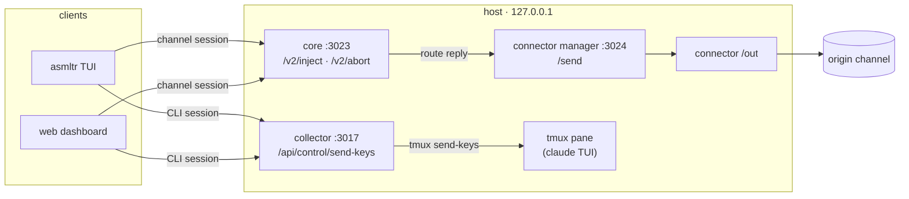

# Session steering & injection

asmltr lets an **operator reach into a live, running session** — stop what it's doing and/or inject a
message to steer it — from the `asmltr` TUI or the web dashboard. This is "background session
injection": the session keeps running on the host (behind a channel, or in a tmux pane), and you
redirect it out-of-band without being the one who originally started the conversation.

There are **two mechanisms**, chosen automatically by session type. They feel the same in the UI but
work very differently underneath.

| | **SDK / channel sessions** | **CLI sessions** |
|---|---|---|
| Examples | discord, telegram, mcp, github | `asmltr claude` (interactive Claude Code in tmux) |
| Runs as | the core's local Agent SDK turn | a real interactive `claude` TUI process |
| Inject via | **core** `POST /v2/inject` (resume-with-text) | **collector** `POST /api/control/send-keys` (types into the pane) |
| Stop via | `POST /v2/abort` (abort the in-flight turn) | send-keys `Escape` / `C-c` (interrupt) |
| The reply | routed back to the **origin channel** | appears in the session's own terminal |
| Full takeover | — (steer only) | `tmux attach -t <target>` (grab the live terminal) |
| Identified by | `multiplexer` ≠ `tmux` | `multiplexer === 'tmux'` (+ a `tmux_target`) |

Both are exposed the same way in the clients:
- **TUI** (`asmltr`): open a session's **watch** view → `i` to steer (inject), `k` to stop.
- **Dashboard**: click a session card → the **conversation-details pane** → type + **Send**, or **Stop/Interrupt**.

---

## 1. SDK / channel sessions — steer via the core

A discord/telegram/mcp/github conversation is a **core session**: `conversation_key → engine_session_id`
in the `sessions` table, run through the local Agent SDK. To steer it you resume that same session with
your text and let the reply flow back out to wherever it came from.

### The reply needs to know where to go: the outbound route

The connector that *started* the conversation is the thin I/O layer — the core normally replies by
returning text to the connector that called it. But an **inject arrives out-of-band** (from the TUI /
dashboard, not from the channel), so the core has to remember the return address.

Every time a turn runs, `handle()` records the session's **outbound route** onto its row:

```
outbound_instance_id  ← the connector instance   (parsed from conversation_key, e.g. discord:<instanceId>:channel:<id>)
outbound_target       ← the channel/chat id       (from channel_context.channelId || chatId || target)
```

(`sessions.setOutboundRoute(key, instance_id, target)`.) That's the address a later inject replies to.

### `POST /v2/inject` (core, `127.0.0.1:3023`)

```jsonc
// request
{ "conversation_key": "discord:<instanceId>:channel:<id>", "text": "actually, summarize instead", "by": "dashboard" }

// response
{ "ok": true,
  "reply": "Sure — here's the summary…",
  "delivered": true,                 // was the reply POSTed to the origin channel?
  "deliverErr": null,                // or e.g. "no stored outbound route for this session"
  "route": { "instance_id": "…", "target": "…" } }
```

What it does, in order:

1. **Stop the current turn.** If a generation is in flight for this key, abort it — a steer *replaces*
   the current turn (the SDK can't inject mid-generation).
2. **Serialize per session** (`withKeyLock`) so a steer and a normal turn never overlap.
3. **Resume + run.** `resolveForTurn(key)` gives the `resume` id; `runTurn({ prompt: text, resume, cwd })`
   runs your text as the next turn of that same session, in its original working dir. Tool / thinking /
   tool-result events are emitted to the collector so the details pane stays live.
4. **Redact + record.** The reply is passed through `redactSecrets()` (same masking as any public output)
   and logged as an `outbound` event with `injected: true`.
5. **Route it home.** If the session has a stored outbound route, the core POSTs the reply to the manager
   `POST /send { instance_id, target, text }`, which forwards to that connector's `/out` — so it lands in
   the original Discord channel / Telegram chat / etc. `delivered` reports whether that succeeded.

> The operator is trusted, so an inject **bypasses moderation** — but the reply is still redacted on the
> way out, exactly like a normal channel reply.

### `POST /v2/abort` (core)

```jsonc
{ "conversation_key": "discord:<instanceId>:channel:<id>" }   // → { "ok": true, "aborted": "<key>" }
```

Aborts the in-flight turn for that key. **The session is not killed** — its `engine_session_id` is
untouched, so the next message (or a later inject) resumes it. `404` if nothing is in flight.

---

## 2. CLI sessions — send keys into the tmux pane

`asmltr claude` runs an interactive Claude Code TUI inside a **tmux** session (see the wrapper in
`cli/asmltr-claude.js`). There is no SDK turn to resume — it's a live terminal program. So "injection"
here means literally **typing into its pane**, and "takeover" means **attaching to the tmux session**.

How such a session gets on the dashboard in the first place:

- the wrapper registers it in a tracker (`~/.asmltr/cli-sessions.json`) that the collector's
  `reconcile.js` mirrors into the `sessions` table (with `multiplexer: 'tmux'` + a `tmux_target`);
- a **transcript tailer** (`cli/lib/claude-tailer.js`) streams the session's `~/.claude/**/*.jsonl`
  into the collector `/ingest` as inbound/thinking/tool/tool_result/outbound events — that's the live
  conversation you see in the details pane.

### `POST /api/control/send-keys` (collector, `127.0.0.1:3017`)

```jsonc
{ "session_id": "asmltr-cli-<id>", "text": "run the tests", "enter": true }   // type a line + press Enter
{ "session_id": "asmltr-cli-<id>", "keys": "Escape" }                          // interrupt the current turn
{ "session_id": "asmltr-cli-<id>", "keys": "C-c" }                             // send Ctrl-C
```

Backed by `control.sendKeys()`, which runs `tmux send-keys -t <tmux_target> …`. It refuses any session
without `multiplexer === 'tmux'` + a `tmux_target` (you can only send-keys into an `asmltr claude`
session), and every action is written to the control-plane audit log.

### Full takeover

The details pane shows the attach command; run it in any terminal to grab the live session:

```bash
tmux attach -t asmltr-cli-<id>
```

Detach again with `Ctrl-b d` and it keeps running + monitored. Quitting claude ends it.

---

## How the clients reach these endpoints



- The **dashboard** is a static SPA; its nginx proxies `/v2/*` → core and `/api/control/*` → collector,
  injecting the right bearer server-side (see `insights/dashboard/nginx.conf.template`). Public access is
  behind Authelia, so only the allowed operator can steer.
- The **TUI** calls the core (`ASMLTR_CORE_BASE`) and collector (`ASMLTR_COLLECTOR_BASE`) directly on
  localhost.

## Security notes

- `/v2/*` and `/api/control/*` are **localhost-only**; nothing binds a public interface. The dashboard is
  the only public door and it is Authelia-gated to specific users.
- Control routes take the stronger **control token** when one is set (`ASMLTR_INSIGHTS_CONTROL_TOKEN`);
  the Authelia-forwarded `Remote-User` becomes the audit actor.
- Injection bypasses moderation (trusted operator) but SDK replies are still **redacted** before they
  leave the box. tmux send-keys goes straight to the terminal — treat it like typing at the keyboard.

## Where it lives in the code

| Piece | File |
|---|---|
| `/v2/inject`, `/v2/abort`, outbound-route capture | `core/src/server.js` |
| outbound route storage (`setOutboundRoute`) | `core/src/sessions.js` |
| unified outbound `POST /send` → connector `/out` | `connectors/manager/server.js` |
| `send-keys` control + audit | `insights/collector/control.js`, `server.js` |
| CLI wrapper + transcript tailer + reconcile | `cli/asmltr-claude.js`, `cli/lib/claude-tailer.js`, `insights/collector/reconcile.js` |
| TUI steer/stop | `cli/tui.js` |
| dashboard conversation-details pane | `insights/dashboard/src/components/SessionDetail.vue` |
