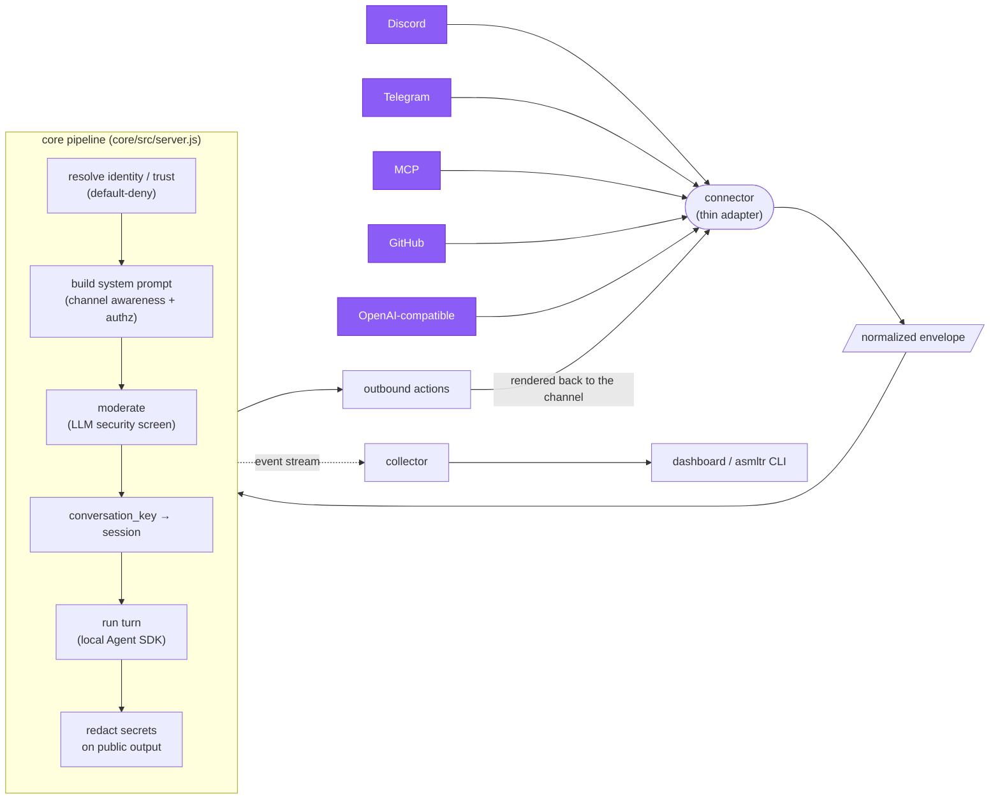

# Architecture

asmltr is **one channel-agnostic backend behind every chat surface** for a single AI
assistant. A thin **connector** turns a channel's messages into a normalized **envelope**;
the **core** resolves identity and trust, builds the system prompt, moderates, maps the
`conversation_key` to a session, runs the turn on the **local Agent SDK**, redacts secrets
from public output, and hands back **outbound actions** the connector renders. Every step
emits a telemetry event to the **collector**, which the dashboard and `asmltr` CLI read.

## Pipeline



A connector is **thin I/O**: it knows *how* its channel works (tokens, polling, message
shapes) and nothing else. Everything shared — sessions, identity, trust, moderation,
prompt-building, execution, redaction — lives in the core. Adding a channel means writing
one adapter that emits an envelope and renders a reply.

## The non-negotiables

!!! danger "Violating these breaks the model"
    These four constraints are load-bearing. They are enforced in code and are the reason
    the deployment topology looks the way it does.

- **Execution is LOCAL via the Agent SDK** (`@anthropic-ai/claude-code`), on the user's
  Claude subscription — the same auth Claude Code uses. There is **no `ANTHROPIC_API_KEY`
  execution path**: the core deletes `ANTHROPIC_API_KEY` from its environment at startup
  (`core/src/server.js`), so agent turns can never silently switch to metered billing or a
  sandbox that loses local filesystem / project-context / skills access.
- **`core/` and `insights/collector/` run on the HOST under PM2, never in Docker.** They
  spawn the local `claude` binary (which needs `~/.claude` auth, host filesystem, and your
  project context) and signal host PIDs. Containerizing them breaks both. **Connectors may
  be containerized** and reach the host services via `host.docker.internal`.
- **Bind `127.0.0.1` only.** All three services listen on localhost. Put a reverse proxy
  (with its own auth) in front of anything you expose to the internet.
- **Root permission-mode quirk.** Running as `root`, the CLI rejects
  `--dangerously-skip-permissions`; the SDK's `permissionMode: 'bypassPermissions'` is the
  working equivalent, set in `core/src/runner.js`.

## Components

| Dir | What | Runs as |
|---|---|---|
| `core/` | **asmltr-core** — the channel-agnostic backend: envelope pipeline, sessions, trust, moderation, execution, redaction. | Host process (PM2), `127.0.0.1:3023` |
| `connectors/` | The connector **manager** (supervisor + config API) and the connector **types** (`discord`, `telegram`, `mcp`, `github`, `openai`). Each enabled instance runs as its own child process. | Host process (PM2), manager on `127.0.0.1:3024` |
| `insights/collector/` | Telemetry **collector** — ingests the shared event stream, samples metrics, serves REST + socket.io. | Host process (PM2), `127.0.0.1:3017` |
| `insights/dashboard/` | Vue 3 dashboard: live sessions, cross-surface timeline, usage, the trust **Access** page. | Static build (front with your own proxy/auth) |
| `cli/` | **`asmltr`** — terminal client + TUI over the collector/core/manager APIs. | Host CLI |
| `shared/` | Cross-cutting modules: the event-stream contract (`events.js`), the secret provider (`secrets.js`), the `.env` loader (`loadenv.js`), and the redaction layer (`redact.js`). | — (imported by the others) |

## Session model

Each channel computes a `conversation_key` (e.g. `discord:<instance>:guild:<id>`,
`github:<instance>:repo:<owner/name>:issue:<n>`). That key is the primary key of the core's
`sessions` table (`core/src/sessions.js`) and maps to the **SDK-assigned**
`engine_session_id`.

- The Agent SDK *assigns* the session id (unlike the CLI's `--session-id`); the core
  captures it from the first `system`/`result` event of the turn and persists it.
- The next turn on the same key **resumes** via the SDK's `options.resume`. This one
  mechanism subsumes Discord-per-server, Telegram-per-user, MCP-per-user, etc. — they are
  just different key formulas.
- Resume uses the **same `cwd`** the session was born in (that is how `claude --resume`
  locates it), so the working dir is stored per session. The default spawn dir is the
  running user's home (override with `ASMLTR_SESSION_CWD`).
- An `idle_policy` of `idle:<minutes>` starts a fresh session past the window; the default
  `infinite` always resumes.

Sessions can be **claimed** for takeover (a human resumes the session in a terminal while
the channel pauses) and **steered** mid-turn — see [Steer & takeover](reference/api.md).

## Event stream

The core emits telemetry the whole way through the pipeline using the single shared contract
in `shared/events.js`. Both the core (producer) and the collector (consumer) import that
module, so the wire format cannot drift. Each event is one JSON object:

```json
{ "v": 1, "ts": 0, "surface": "discord", "session_id": "...", "identity": "...",
  "event_type": "tool", "tokens_in": 0, "tokens_out": 0, "cost_usd": 0,
  "payload": {}, "source": "core" }
```

- **`surface`** — one of `discord`, `telegram`, `voice`, `eve-assistant-web`,
  `eve-assistant-native`, `mcp`, `github`, `openai`, `claude-code`, `system`, `core`.
- **`event_type`** — `inbound`, `outbound`, `thinking`, `tool`, `tool_result`,
  `token-usage`, `identity_resolved`, `moderation_decision`, `session-start`,
  `session-end`, `system-sample`, `notification`, `control`.
- **`cost_usd`** is `0` on subscription-backed surfaces; it is `> 0` only where an API key
  backs the call.

The core exposes a live SSE feed at `GET /events/stream` and also POSTs events to the
collector's `/ingest`; the dashboard and CLI read the collector's REST + socket.io API.

## See also

- [Trust & permissions](security/trust.md)
- [Secrets & configuration](security/secrets.md)
- [Configuration & environment](reference/config.md)
- [HTTP endpoints](reference/api.md)
