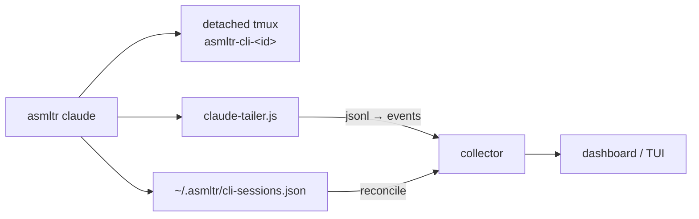

# CLI sessions

The CLI connector isn't a chat channel — it brings **your own interactive `claude` sessions** under
asmltr monitoring. Run:

```bash
asmltr claude [args…]
```

and it launches a normal interactive Claude Code session, but wrapped so the session appears live in
the dashboard and can be steered, interrupted, or attached ("taken over") like any managed session.
Any arguments after `claude` are passed straight through to the `claude` binary.

---

## How it works

1. **tmux.** The session is started in a **detached tmux session** (`asmltr-cli-<id>`), so it
   survives you detaching and can be attached from elsewhere. `tmux` is required
   (`apt install tmux`).
2. **Tracker.** The session is registered in a tracker JSON (`~/.asmltr/cli-sessions.json`) with its
   tmux target, pid, cwd, and status.
3. **Reconciler.** The insights collector reconciles that tracker
   (`insights/collector/reconcile.js`) into its sessions table, so the session shows up as a
   `claude-code` card in the dashboard. The reconciler also applies a **liveness correction** — a
   session marked active whose pid is dead is recorded as ended — so the dashboard's instance count
   stays honest.
4. **Transcript tailer.** A detached tailer (`cli/lib/claude-tailer.js`) discovers the session's
   transcript under `~/.claude/**/*.jsonl` (the newest one created after launch), tails it, and
   streams each turn to the collector as `inbound` / `thinking` / `tool` / `tool_result` /
   `outbound` events — so the dashboard's details pane shows the live conversation and tool history.
   It exits and emits a session-end when the tmux session goes away.



---

## Detach and re-attach

- **Detach:** `Ctrl-b d` — leaves the session running **and still monitored**.
- **Re-attach:** `tmux attach -t <target>` — the target is the `asmltr-cli-<id>` name printed on
  launch (also visible in the dashboard). Anyone with tmux access to the box can attach to take over
  a session.
- **End:** quitting `claude` ends the session; the tracker is marked `ended` and the tailer flushes
  a final event.

---

## Resolving the `claude` binary

`asmltr claude` resolves a **real** `claude` executable up front (so it fails loudly instead of
leaving a dead tmux pane): it scans `PATH` for a regular executable file named `claude` (skipping a
stray directory of that name), then falls back to known install locations
(`/usr/local/bin/claude`, `/usr/bin/claude`, `~/.claude/local/claude`, `~/.local/bin/claude`).

!!! tip "Override with `ASMLTR_CLAUDE_BIN`"
    Set `ASMLTR_CLAUDE_BIN` to the full path of the `claude` executable to bypass resolution
    entirely — useful when you have multiple installs or a non-standard location.

---

## Related environment variables

| Variable | Purpose |
|---|---|
| `ASMLTR_CLAUDE_BIN` | Full path to the `claude` executable (overrides PATH resolution). |
| `ASMLTR_CLI_TRACKER_PATH` | Location of the CLI session tracker (default `~/.asmltr/cli-sessions.json`). |
| `ASMLTR_CLI_IDENTITY` | Identity attributed to these sessions (default: the OS username). |
| `ASMLTR_COLLECTOR_BASE` | Collector base URL the tailer posts events to (default `http://127.0.0.1:3017`). |

See [Connectors](index.md) for how the rest of the connector fleet is managed.
