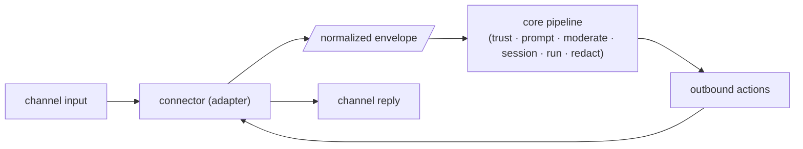

# Connectors

A **connector** is a thin I/O adapter for one chat surface. It knows only *how* its channel
works — tokens, polling, message shapes, attachments — and nothing about identity, memory, or
reasoning. Everything shared lives in the **core**.

The contract each connector implements is small:

1. Receive channel input.
2. Build a **normalized envelope** and call `ctx.core.handle(envelope)`.
3. Render the returned actions back onto the channel.



Because the core owns trust, moderation, sessions, and redaction, adding a new channel means
writing *one* adapter — not another copy of the assistant.

---

## The manager

The **connector manager** (`connectors/manager/server.js`) is a host process (run under PM2,
bound to `127.0.0.1:3024`) that acts as a registry, supervisor, and config API. It is the plane
the dashboard's "Integrations" page drives.

Each **enabled instance runs as its own child process**, supervised by the manager. Crashing one
instance never takes down another or the core.

!!! note "Bind local, front with a proxy"
    The manager binds `127.0.0.1` only. If you expose it, put a reverse proxy with auth in front.
    Set `ASMLTR_MANAGER_TOKEN` to require `Authorization: Bearer <token>` on every endpoint.

### Managing instances via the API

```bash
# List available connector types (each with its meta + configSchema)
curl -s 127.0.0.1:3024/types

# List instances + live runtime status
curl -s 127.0.0.1:3024/instances

# Create an instance (validated against the type's schema; started if enabled:true)
curl -s -X POST 127.0.0.1:3024/instances -H 'Content-Type: application/json' -d '{
  "type":"telegram","name":"my-bot","enabled":true,
  "config":{"bot_token_bws_key":"telegram_bot_token"}
}'

# Update config/name/enabled (send the FULL merged config — it is re-validated)
curl -s -X PATCH 127.0.0.1:3024/instances/<id> -H 'Content-Type: application/json' -d '{
  "config":{"bot_token_bws_key":"telegram_bot_token","allowed_chat_ids":[12345]}
}'

# Lifecycle
curl -s -X POST 127.0.0.1:3024/instances/<id>/start
curl -s -X POST 127.0.0.1:3024/instances/<id>/stop
curl -s -X POST 127.0.0.1:3024/instances/<id>/restart

# Tail recent logs, or delete (stop + remove)
curl -s 127.0.0.1:3024/instances/<id>/logs
curl -s -X DELETE 127.0.0.1:3024/instances/<id>
```

| Method / path | Effect |
|---|---|
| `GET /types` | Available connector types, each with its `meta` + `configSchema`. |
| `GET /instances` | All instances with live runtime status. |
| `POST /instances` | Create (validate vs type schema). Starts it if `enabled:true`. |
| `GET /instances/:id` | Instance detail + recent logs. |
| `PATCH /instances/:id` | Update `config` / `name` / `enabled`. Restarts if running. |
| `DELETE /instances/:id` | Stop + remove. |
| `POST /instances/:id/start\|stop\|restart` | Lifecycle control. |
| `GET /instances/:id/logs` | Recent logs. |

!!! warning "PATCH takes the full config"
    A `PATCH` with a `config` object replaces the instance config wholesale (it is validated
    against the type schema on write). Always send the **complete merged** config, not just the
    fields you changed.

---

## `meta.configSchema`

Every connector type exports a `meta` object. The manager reads it via `require()` at startup and
exposes it at `GET /types`, so the dashboard can render a form for any connector without special
casing. The important pieces:

- **`type` / `displayName`** — the id and human label.
- **`supportsMultiple`** — whether more than one instance of this type may run.
- **`configSchema`** — a JSON-Schema-like object describing config fields, defaults, and which are
  `required`. The manager validates `POST`/`PATCH` bodies against the `required` list before
  creating or updating an instance.
- **`credentialKeys`** — config fields that name a secret (resolved at runtime through the secret
  provider — never a raw value in config).

### `outbound` and `capabilities`

Two flags shape how the core and manager treat a connector:

- **`outbound`** — declares that the connector can be *pushed to*. When present, the manager's
  `POST /send` can route a message out through the instance's `/out` endpoint (used by admin
  alerts and any outbound caller). Request/response-only connectors (like `openai`) set
  `outbound: false`.
- **`capabilities`** — what the channel can render, passed into the envelope so the core can tailor
  output. Notably `supports_attachments_out` tells the core the channel can deliver files/photos;
  others include `max_message_chars`, `supports_markdown`, and `supports_code_blocks`.

---

## Connector types

| Type | What it is | Docs |
|---|---|---|
| `discord` | Mention + autonomous chat, commands, multi-agent rooms, optional voice mode. | [Discord](discord.md) |
| `telegram` | 1:1 bot with photo → vision. | [Telegram](telegram.md) |
| `mcp` | OAuth 2.1 MCP server exposing an `ask_<assistant>` tool. | [MCP](mcp.md) |
| `github` | Mention-driven, repo-aware issue assistant. | [GitHub](github.md) |
| `openai` | OpenAI-compatible REST API (`/v1/chat/completions`). | [OpenAI-compatible](openai.md) |
| `cli` | Interactive `claude` sessions in tmux, monitored + steerable. | [CLI](cli.md) |

!!! tip "Discover schemas at runtime"
    `GET /types` returns the live `configSchema` for every registered connector — the source of
    truth if this table drifts from the code.
