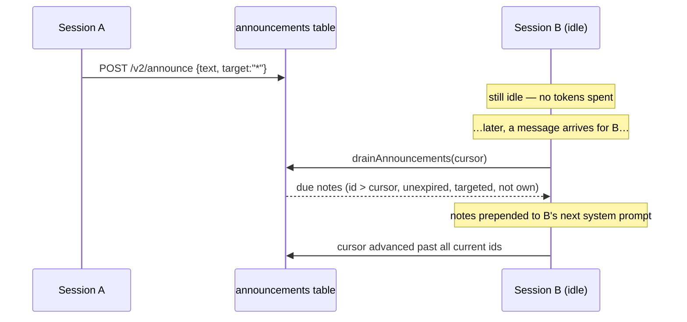

# Cross-session announcements

Announcements are a **per-session mailbox** for awareness notes between the sessions running on
one machine. A session (or an operator) posts a short note; every *other* session picks it up
into its context at the **start of its next turn**. It's how one session says "heads up, I'm
already refactoring the auth module" and the others find out — without touching any channel and
without spending tokens on sessions that are sitting idle.

!!! note "Announcement vs. cross-channel send"
    An [`asmltr send`](cross-channel.md) delivers a *message to a human* on a channel.
    An `asmltr announce` delivers an *awareness note to other sessions* — it never posts to a
    channel and no user sees it. They solve different problems; don't reach for one when you
    mean the other.

## Posting: `POST /v2/announce` (core, `127.0.0.1:3023`)

```jsonc
// request
{ "text": "refactoring core/src/trust — hold off on that file",
  "target": "*",          // optional; default "*" (all sessions) — see Targeting below
  "priority": "normal",   // optional; "normal" | "urgent"
  "from": "dashboard",    // optional label recorded as from_session
  "ttl": 3600 }           // optional TTL in SECONDS; omit for no expiry

// response
{ "ok": true, "id": 42, "created_at": 1720000000000, "target": "*" }
```

Or from inside a turn (via the Bash tool), which is how a session announces to its peers:

```bash
asmltr announce "<text>" [--to <target>] [--urgent] [--ttl <seconds>]

# examples
asmltr announce "deploying edison in ~5 min, expect a blip"
asmltr announce "I own the DB migration — don't run migrations" --to surface:discord --urgent
asmltr announce "staging is up for the next hour" --ttl 3600
```

`asmltr announce` (see `cmdAnnounce` in `cli/asmltr.js`) parses the flags out and `POST`s
`{ text, target, priority, from, ttl }` to `/v2/announce`. Every session is told this verb
exists via the [ASMLTR TOOLBELT](awareness.md#the-toolbelt-in-every-system-prompt) block in its
system prompt.

## Delivery: drained into the next turn

Each announcement carries a **`created_at` timestamp** and a monotonically increasing **id**.
Delivery is cursor-based, so each note reaches each session exactly once:

- The `sessions` table gives every session a `last_announce_id` cursor.
- At the top of a turn, the core calls `sessions.drainAnnouncements(key, channel, identity)`.
  That selects live announcements whose `id` is past this session's cursor, that **target** this
  session, that haven't **expired**, and that this session **didn't post itself** — then advances
  the cursor past all current announcements so each is evaluated only once. (It caps at the 15
  most recent so a long-idle session doesn't get flooded on wake-up.)
- Anything due is formatted with its timestamp and prepended to that turn's system prompt under a
  `📢 ANNOUNCEMENTS from other sessions on this machine` heading — awareness only, to act on
  *if relevant*.



## Targeting

The `target` field (`--to` on the CLI) decides which sessions a note reaches. Matching lives in
`_targetMatches()` in `core/src/sessions.js`:

| `target` | Reaches |
|---|---|
| `*` (default) | every session |
| `<conversation_key>` | one specific session (its exact key) |
| `surface:<channel>` | all sessions on that channel — e.g. `surface:discord`, `surface:telegram` |
| `identity:<key>` | all sessions belonging to a resolved user — e.g. `identity:alice` |

A session **never receives its own** announcement (matched by `from_session`), so you can safely
target `*` from a session without echoing back to yourself.

## TTL / expiry

Pass `--ttl <seconds>` (`ttl` in the API) to set an `expires_at`. Expired announcements stop
being delivered *and* stop showing up in the live list — useful for "staging is up for the next
hour" notes that shouldn't linger. Omit it for a note that lives until the row is gone.

## Listing live announcements

```bash
asmltr announcements        # prints each live note with its timestamp, target, urgency, expiry
```

```jsonc
// GET /v2/announcements  →
{ "announcements": [
    { "id": 42, "target": "*", "text": "…", "priority": "normal",
      "from_session": "dashboard", "created_at": 1720000000000, "expires_at": null }
] }
```

`GET /v2/announcements` (and `asmltr announcements`) return everything currently **live**
(unexpired), independent of any session's cursor — this is the "what's on the board right now"
view, not a per-session inbox.

## The honest limitation: next-activity, not instant

!!! warning "Idle sessions get it on their **next** turn, not immediately"
    An announcement is **guaranteed-on-next-activity**, not real-time. A session that is sitting
    idle receives the note only when it next runs a turn (a new channel message, or an
    [operator inject/steer](injection.md)). This is a deliberate trade-off:

    - **no tokens burned on idle sessions** — nothing runs until there's real work anyway;
    - **no channel side effects** — a session isn't forced to suddenly post something;
    - **exactly-once** delivery per session via the cursor.

    The cost is latency: if a session never activates again, it never sees the note. Announcements
    are for *coordination-on-next-touch*, not push notifications.

    A true **fan-out broadcast** — proactively waking every session to act *now* — is a different
    concept and is **not** what this is. (The connector manager has its own unrelated deferred
    `POST /announce` that re-delivers a queued channel message after a restart; don't confuse it
    with this per-session mailbox.)

## Where it lives

| Piece | File |
|---|---|
| `POST /v2/announce`, `GET /v2/announcements` | `core/src/server.js` |
| mailbox table, cursor drain, targeting, TTL | `core/src/sessions.js` (`addAnnouncement`, `drainAnnouncements`, `_targetMatches`, `listAnnouncements`) |
| draining into the system prompt each turn | `core/src/server.js` (`handle()`) |
| `asmltr announce` / `asmltr announcements` | `cli/asmltr.js` (`cmdAnnounce`, `cmdAnnouncements`) |

## See also

- [Session awareness (ls / map / who)](awareness.md) — check what other sessions are doing.
- [Cross-channel send (copy & redirect)](cross-channel.md) — deliver a message to a human on
  another channel.
