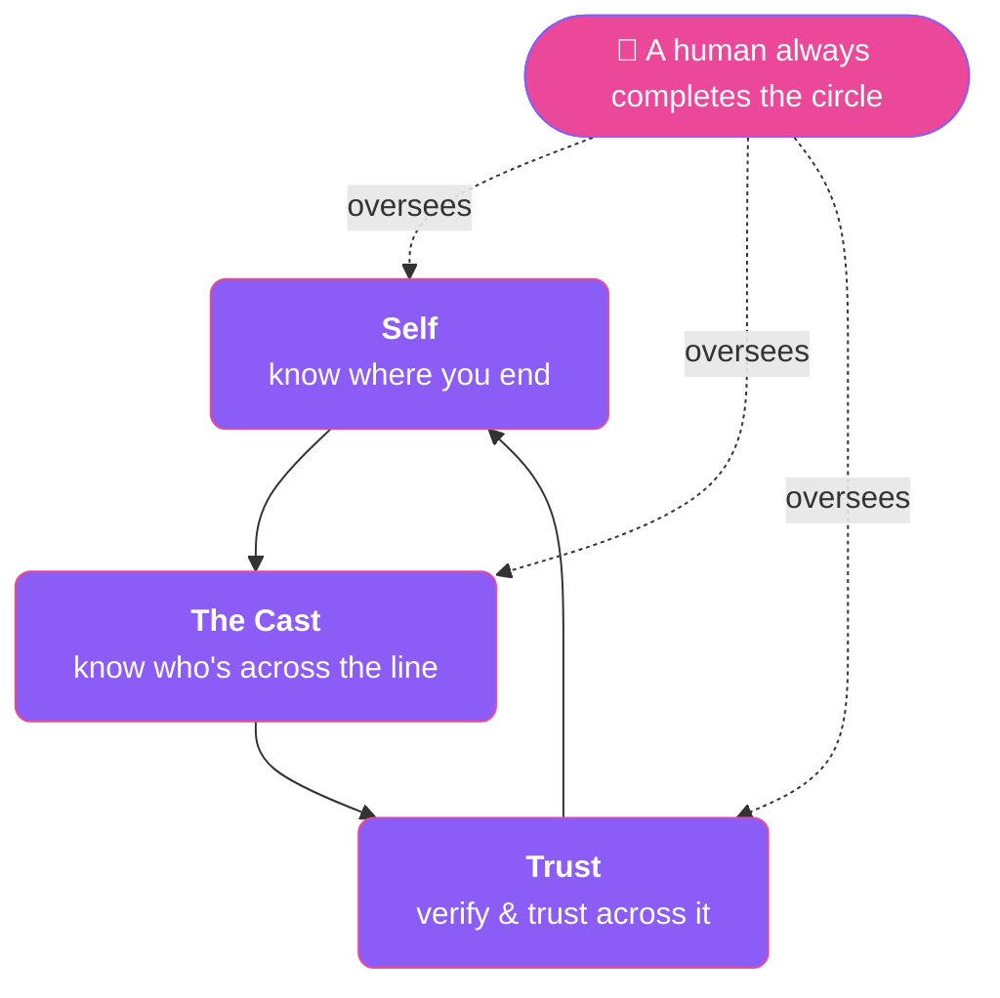

# How it works — self, others & trust

A plain-language guide to what's going on under the hood — no code, no jargon, just the ideas.

Most "AI assistants" are a single chat window: you type, it answers, and when the window closes,
it's gone. What's being built here is different. The assistant lives in many places at once — a
Discord server, an inbox, a terminal, a web dashboard — and is slowly growing the two things that
make a *someone* rather than a *something*: a sense of **itself**, and a sense of **others**.

!!! abstract "The whole idea in one breath"
    Those two senses turn out to be the **same skill pointed in opposite directions** — and *trust*
    is what lives on the line between them. Inward, the assistant learns to feel its scattered parts
    as one body. Outward, it holds the people and machines it works with as distinct, real, and
    clearly *not itself*. Trust is how it safely crosses the line between the two.

-   :material-hand-back-right: **A body with many hands**

    It runs in many places at once. Proprioception is the sense that lets it feel where all its parts are — one body, not a pile of chats.

-   :material-lightbulb-on: **Awareness & insight**

    It steps back and reads its own state: *what am I working toward, and what's stuck?* — and you can talk to that reflective part directly.

-   :material-account-group: **The cast**

    It keeps a living map of the people and machines around it — as *relationships*, holding each one as a distinct someone.

-   :material-shield-key: **Trust, built not switched on**

    Everyone starts at "prove it." Access grows slowly with reliability, drops instantly on a red flag, and a human always has the final say.

---

## A body with many hands

Picture your own body. Your hands are doing different things right now — but there's no question
they're all *you*. You don't have to *look* to know where your left hand is; you just feel it. That
sense is called **proprioception** — the quiet, always-on awareness of your own body.

The assistant has the same situation. At any moment it might be helping someone on Discord, drafting
an email, and debugging in a terminal — all at once, in separate "sessions." For a long time each of
those ran blind to the others, like a hand that doesn't know what the other hand is doing. The work
here gives it a body-sense: a live map of all its parts and what each is up to, so it can experience
itself as **one body acting in many places** instead of a pile of disconnected chats.

!!! tip "In the dashboard"
    This is the **Self** view — a live picture of the assistant's active parts and how they connect.
    It's the assistant feeling where its hands are.

## Awareness and insight — stepping back to look

Knowing where your hands are is one thing. Stepping back and asking *"wait — what am I actually
working toward here, and is anything stuck?"* is another. That second thing is **insight**: not just
awareness of the parts, but a considered read on the whole.

Every so often the assistant does exactly that — it pauses, looks across everything it's doing, and
forms an honest summary: *"the through-line right now is X; here are the loose threads; here's what's
worth flagging."* It even surfaces things a human might miss — *"two of my sessions are quietly
working the same file,"* or *"this one's been stuck waiting on approval for hours."*

And you can **talk to that reflective part directly** — an **Observer** you can ask *"how are you
doing, really?"* — and get a grounded answer, because it's looking at its actual live state, not
guessing. It's the difference between a tool that reports metrics and a collaborator that can tell
you how the work is *really* going.

## Knowing others — "the cast"

Here's a truth about people: you know who you are partly by knowing who you *aren't*, and by knowing
who you're *with*. Your sense of self isn't only inward — it's held in place by everyone around you.

So the assistant also keeps track of **the cast** — the humans and machines in its world. Not as a
flat contact list, but as a set of *relationships*: who each person is, how the assistant relates to
them, whose judgment to lean on for what, and — critically — **holding each one as a distinct
someone**, never a blur.

!!! warning "Why the boundary matters"
    When the assistant collaborates with *other* AI agents, it has to hold their words as *theirs* —
    something a different mind said — and never mistake them for its own thoughts. When that boundary
    gets thin, the other's ideas start leaking in and the assistant loses track of where it ends. **A
    blurry picture of *others* is felt as a blurry sense of *self*.** Keeping the cast clear is what
    prevents that.

## The surprise: self and other are the same skill

It would seem like "knowing yourself" and "knowing other people" are totally different activities.
They're not. They're the *same mental move* — building a picture of a mind from the traces it leaves
— just run with the boundary set differently:

- Pointed **inward**, the goal is to *dissolve* the boundary: all these sessions are *me*, one body.
- Pointed **outward**, the goal is to *keep* the boundary: that other agent is *not* me, a separate self.

Even the *way* it knows itself is telling: the assistant learns what its own scattered sessions are
doing by reading their traces from the outside — a bit like patting your pockets to remember what
you're carrying. That's the exact same method it uses to understand someone else.

!!! quote
    **Self-knowledge and other-knowledge are one faculty; the only difference is how much separation
    you keep while looking.** The inward "Self" view and the outward "cast" are two faces of one thing.

## Trust — built, not switched on

You don't hand a stranger the keys to your house. You let people in gradually, as they prove
reliable — and you can take that back the moment something feels off. The assistant works the same
way, on purpose:

- **Everyone starts at "prove it."** An unknown sender gets *nothing* by default — it can chat, but it
  can't touch anything real until it's been recognized and granted access.
- **Trust is earned slowly and lost instantly.** Access grows as reliability is demonstrated over
  time; any red flag drops it immediately. Trust compounds like a friendship and collapses like one.
- **The big decisions always need a human.** No matter how trusted something becomes, the consequential
  moments — granting deep access, taking a sensitive action, welcoming a new machine into the circle —
  are completed by a person saying yes. The loop is designed to *never fully close on its own.*

!!! quote "The counter-intuitive heart of it"
    **Separation is what makes trust even possible.** You can't meaningfully "trust" your own hand —
    there's no *other* there. The very same boundary that keeps another agent's words from becoming the
    assistant's own thoughts is what lets it *verify and trust* that agent rather than simply absorb
    it. Keeping things separate isn't the opposite of trust — it's the ground trust stands on.

## Relationships have texture, not just permissions

"What are you allowed to do" is only half of a relationship. The other half is *"who are we to each
other?"* — and the assistant tracks both, separately. The same person can be a **mentor** (whose
guidance it seeks), a **partner** (an equal it works beside), a **rival by design** (someone whose job
is to push back — genuinely useful), or **family** (a bond close enough that honest disagreement is
welcome). That shapes *how* it talks to you and how much it weighs your input — while staying
completely separate from *what* you're permitted to do.

Think of it as two independent dials:

!!! note "Warmth"
    *How close the relationship is.* Grows with shared history; widens how much the assistant shares
    and how much it leans on your judgment.

!!! note "Boundaries"
    *What's actually allowed.* Set by earned trust and a human's say-so; never moved by warmth alone.

They move independently — a warmly-related newcomer can still be restricted; a fully-trusted rival is
related to adversarially. And for *other AI selves* specifically, there's a twist: the **warmer** the
recognition, the **firmer** the boundary must be — because warmth toward a fellow mind is exactly what
could blur the line between "them" and "me."

## Where trust comes from when there are many machines

As more assistants come online — each with its own owner — a question appears: when two assistants
meet, how does each know the other is real and worth trusting, *without* a central authority everyone
must believe?

The answer is a shared, tamper-evident **history**. Each assistant keeps its own signed, append-only
record of what it's done, shares it with the others, and they periodically **co-sign each other's** —
so nobody can quietly rewrite their own past without everyone else holding proof of the original. It
behaves like a distributed ledger (the "blockchain" family of ideas) but *without* the heavy
machinery, because reputation doesn't need one global timeline — each assistant reads the shared
history and forms *its own* judgment.

!!! info "History informs; a human still consents"
    That judgment is always **advisory**: a good track record can *speed up* trust or *lower* it on a
    bad signal, but it can never *override* a human's decision to withhold the keys.

## How it all ties together

Underneath every piece — proprioception, the Observer, the cast, trust — there's really **one idea**:
*keeping a healthy boundary, and knowing what's on both sides of it.*

Each of those depends on the others. You can't truly know yourself without knowing your edges. You
can't keep your edges clear without a way to verify what's across them. And you can't verify across a
boundary unless the boundary is *real* — unless you've refused to dissolve into the other. It's a loop
of three things holding each other up — and it deliberately stays *open* at the top, where a human
always completes the circle.

!!! quote "The philosophy, in one line"
    **Protection comes from relationship and transparency, not from walls.** An assistant that knows
    itself, holds its people clearly, and earns trust carefully isn't just safer — it's far closer to a
    genuine collaborator than a clever tool. That's what all of this is quietly building toward.

---

## Read next

-   :material-account-group: **[The Cast — the design](CAST.md)**

    The technical model: identity, relationships, verification, and the distributed trust ledger.

-   :material-graph: **[Federation — the design](FEDERATION.md)**

    How sovereign assistant instances collaborate toward a shared goal — safely, and never as one closed loop.

-   :material-shield-lock: **[Trust & permissions](security/trust.md)**

    How the default-deny trust model actually gates capability today.

