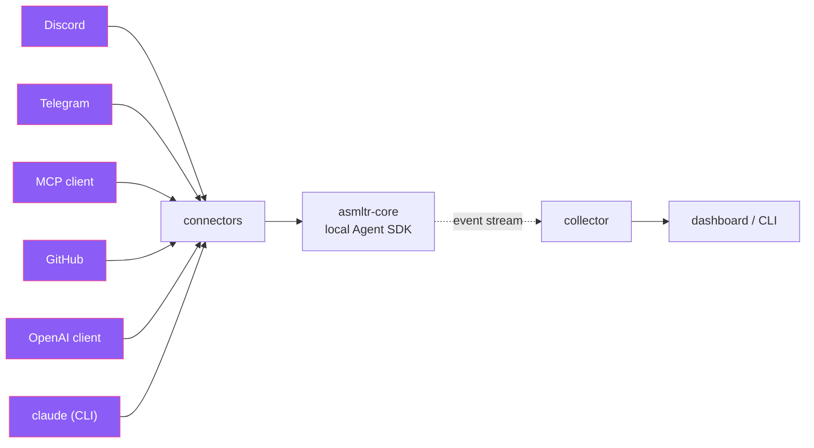

# asmltr

One channel-agnostic AI-assistant backend behind every chat surface — with a live insights dashboard.

Run **one** assistant and let people reach it from **Discord, Telegram, an MCP client, GitHub issues,
or any OpenAI-compatible client** — all through the same brain, with shared memory, a unified
trust/permission model, moderation, and per-secret output redaction. Its thinking runs on a
**[swappable engine](engines.md)** — Claude Code (on your subscription, the default), Gemini, Codex, or
a self-hosted model — and whichever you pick drives every channel. A collector + dashboard give you one
pane of glass over everything the assistant is doing, and a CLI lets any session watch, steer, and
coordinate with the others.

!!! note "The default engine uses your Claude subscription — no metered API key"
    The Claude engine executes through the **local Agent SDK on your Claude subscription** — there is
    **no `ANTHROPIC_API_KEY` execution path**. Other engines (Gemini/Codex/self-hosted) use their own
    login or a vault-stored API key. See [Reasoning engines](engines.md) · [Architecture](architecture.md).

- :material-rocket-launch: **[Get started](getting-started/overview.md)**

    What asmltr is, how to install it, and a quick first channel.

- :material-sitemap: **[Architecture](architecture.md)**

    Adapter → envelope → core (SDK) → redact → outbound, plus the collector & dashboard.

- :material-brain: **[Reasoning engines](engines.md)**

    Run on Claude, Gemini, Codex, or a self-hosted model — one choice drives every channel.

- :material-hub: **[Connectors](https://github.com/jarethmt/asmltr/blob/main/connectors/index.md)**

    Discord, Telegram, MCP, GitHub, an OpenAI-compatible API, and interactive CLI sessions.

- :material-console: **[The CLI](cli.md)**

    `asmltr ls / map / who / send / announce / watch / attach / claude` — observe, coordinate, take over.

- :material-view-dashboard: **[The dashboard](dashboard.md)**

    Live sessions, conversation-details + takeover, per-channel toggles, and content search.

- :material-shield-lock: **[Security](security/trust.md)**

    Default-deny trust, moderation, output redaction, and a pluggable secret provider.

## Reach the assistant from anywhere

## Coordinate across sessions

asmltr is a **self-reflecting orchestrator**: every session can see the others and work with them.

- **[Steer & take over](coordination/injection.md)** a live session — stop a turn, inject a message, or attach it.
- **[Cross-channel send](coordination/cross-channel.md)** — answer on Discord, deliver the file to Telegram.
- **[Announcements](coordination/announcements.md)** — push a timestamped note into every session's next turn.
- **[Awareness](coordination/awareness.md)** — `asmltr map` / `who <path>` show where each session is working, so two of them don't collide.

---

asmltr is open source at [github.com/jarethmt/asmltr](https://github.com/jarethmt/asmltr).
