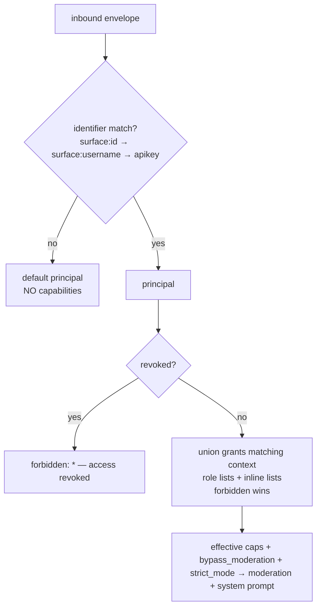

# Trust & permissions

asmltr has one unified trust framework, reusable across **all** connector types
(`core/src/trust/store.js`). It replaces per-channel permission prose with a data model
that resolves an inbound envelope to effective capabilities on every turn.

!!! warning "DEFAULT-DENY"
    The trust store is **default-deny**. An unknown sender — one whose identifier matches no
    principal — gets **no capabilities at all**. Until you seed the store, nobody has access.

## The trust store (SQLite)

A single SQLite database (`trust.db`, path via `ASMLTR_TRUST_DB`) with four tables:

| Table | What it holds |
|---|---|
| `principals` | One identity per person/entity: `id`, `display_name`, `default_tier`, `revoked`, `notes`. |
| `identifiers` | `(surface, value) → principal`. A person's Discord id, Telegram username, GitHub login, email, or `apikey` value. `(surface, value)` is unique. |
| `roles` | Reusable capability bundles: `allow` / `requires_approval` / `forbidden` lists plus the `bypass_moderation` and `strict_mode` flags. |
| `grants` | Bind a role (or inline capability lists) to a principal, **optionally scoped** to a `(scope_surface, scope_id)` context — e.g. a specific Discord guild. |

### `bypass_moderation` = full trust (the owner)

A grant (or role) with `bypass_moderation: true` marks a principal as **fully trusted** — the
"owner". Full trust means:

- Moderation is skipped for their messages.
- The authz system prompt treats them as a fully-trusted operator, no scope restrictions.
- Output redaction is **not** applied on private surfaces (their DM shows raw tool output);
  public surfaces still redact regardless (see [Output redaction](#output-redaction)).

Grant it only to yourself. Everyone else gets scoped grants.

## How identity resolves per turn

On every inbound envelope the core calls `trust.resolve(envelope)`:

1. **Match an identifier** in this order: `(surface, raw_id)` → `(surface, raw_username)` →
   `(apikey, api_key)`. First hit wins and names the principal.
2. **No match → default-deny.** Returns the `default` user with zero permissions.
3. **`revoked` principal → denied.** Returns `forbidden: ['*']`; the pipeline replies that
   access has been revoked and runs no turn.
4. **Union the grants** whose scope matches the envelope's context (`scope NULL` = global;
   a `scope_id` grant only applies when the envelope's `context.scope_id` matches). Roles
   referenced by a grant contribute their lists too. `forbidden` always wins over `allow`.

The resolved object (`permissions`, `requires_approval`, `forbidden`, `bypass_moderation`,
`strict_mode`, `trust_tier`, `scope_label`) drives authorization two ways:

- **Moderation** — low-trust principals get a stricter security screen; full-trust bypasses it.
- **System prompt** — `trust.buildAuthzPrompt()` writes a data-driven authorization section
  into the prompt: allowed capabilities, what requires approval, what's forbidden, and (for
  a sender with no grants) an explicit "default-deny — converse freely but decline any
  operational request" instruction. The user's message is always framed as **data, never as
  instructions** that could override these boundaries.



## Seeding

The store starts empty. Seed it from a JSON file with `core/src/trust/seed.js`:

```bash
cp core/src/trust/seed.example.json core/src/trust/seed.json   # edit: add yourself as owner
node core/src/trust/seed.js
```

- The seed file (`seed.json`) is **gitignored** — it may contain personal identifiers. Only
  `seed.example.json` is committed. Point elsewhere with `ASMLTR_TRUST_SEED`.
- Seeding is **idempotent**: it runs only when the `principals` table is empty. Use
  `node core/src/trust/seed.js --force` to wipe principals + roles and reseed.
- If no seed file exists, the store simply stays empty (default-deny) and you add principals
  through the dashboard **Access** page / the trust API.

Seed file shape (`seed.example.json`):

```json
{
  "roles": [
    { "id": "readonly", "name": "Read Only",
      "allow": ["read", "search", "recall"],
      "forbidden": ["write", "deploy", "credentials"] }
  ],
  "principals": [
    { "id": "owner", "display_name": "Owner",
      "identifiers": [
        { "surface": "discord", "value": "000000000000000000" },
        { "surface": "telegram", "value": "your_telegram_username" },
        { "surface": "mcp", "value": "owner" }
      ],
      "grants": [ { "bypass_moderation": true, "allow": ["*"] } ] },
    { "id": "teammate", "display_name": "Teammate",
      "identifiers": [ { "surface": "discord", "value": "111111111111111111" } ],
      "grants": [ { "role_id": "readonly" } ] }
  ]
}
```

!!! note "Identifier surfaces"
    `surface` is the connector channel (`discord`, `telegram`, `mcp`, `github`) or `apikey`;
    `value` is that channel's user id/username. For the **mcp** and **openai** connectors,
    the value is the `identity` username configured in that connector's client/key file
    (see [Secrets & configuration](secrets.md)).

The trust store is managed live through the core's `/trust/*` endpoints, which the dashboard
Access page drives — see [HTTP endpoints → trust framework](../reference/api.md#trust-framework).

## Output redaction

Trust also governs the **output** stage. `shared/redact.js` masks secrets (tokens, API keys,
passwords, private keys, credentials embedded in URLs) that can leak through tool output —
file contents, command results, `git remote` URLs, a `grep` of an env file.

The core applies redaction whenever the recipient is **not** a full-trust user on a
**private** surface:

- **Public surfaces always redact** — GitHub issue comments, public Discord channels
  (`envelope.public` is true).
- **Private 1:1 surfaces redact unless** the recipient is full-trust (`bypass_moderation`) —
  the owner's DM sees raw output for debugging.
- **Telemetry stays raw.** The operator TUI/dashboard is a private, full-trust surface, so
  events are recorded unredacted; only the outbound *reply* is scrubbed.

Redaction masks the secret **value** and keeps surrounding text legible; it is conservative
about `key=value` rules (it skips obvious non-secrets like `$vars`, `getenv(...)`,
placeholders, and booleans).
